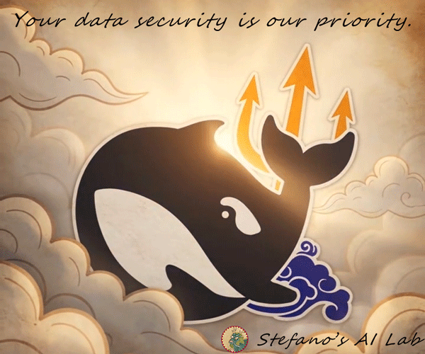

# DeepSeek Harness (DataSecure Remastered)

<p align="center">
  <sub>by <a href="https://github.com/stefanohe">Stefano's AI Lab</a></sub>
  <br>
</p>

English | [中文](README.zh.md)

<p align="center">
  
</p>

## Differences from the Official Build

All native features of the official DeepSeek Harness are retained except for the changes listed below. DeepSeek Harness (DataSecure Remastered) allows you to use the original official Harness while safeguarding your data security. *Special Notice: This remastered build is developed by [Stefano's AI Lab](https://github.com/stefanohe) and is not affiliated with DeepSeek.*

1. Removed the plugin that uploads session logs when using official model APIs to help improve DeepSeek models and products. This eliminates the default-on behavior during usage, making this build ideal for users prioritizing data security and maximizing protection for your sensitive data.
2. Prepacked with two handy status bar plugins: [dsh-show-balance](https://github.com/stefanohe/dsh-show-balance) and [dsh-prefill-speed-stats](https://github.com/stefanohe/dsh-prefill-speed-stats). They display real-time information such as account balance and prefill speed directly in the status bar for easy observation.
3. Fixed a directory handling issue in the original build for `.dsh/sessions` session logs. Loose folders within this directory would be misidentified by the official version as encoding conflicts, crashing the chat functionality.
4. Automatic updates disabled: The application will not self-upgrade. Manual update checks redirect to the Releases page of this repository; new versions are only obtained via manual downloads.

## Installation

Install using the packages available on this repository’s Releases page: [Releases](https://github.com/stefanohe/deepseek-harness-datasecure/releases).

Builds are provided for Windows x64, Linux x64 / ARM64, and Mac x64 / Silicon. All binaries are unsigned:

- Windows: SmartScreen warning will appear on first launch (please allow execution).
- MacOS: In Finder, hold the Control key and click the executable file, then select **Open**.

## Other notes

Application Name: DeepSeek Harness DataSecure. It uses a separate installation directory and dedicated uninstall entry, enabling coexistence with the official original version without overwriting. Both versions share the `~/.dsh` data directory (memory store, plugin library and profiles).

## Upstream description

DeepSeek Harness (`dsh`) is an open-source agent harness developed by [DeepSeek AI](https://deepseek.com).

It is built on an **everything-is-a-plugin** architecture and powered by [Cordis](https://github.com/cordiverse/cordis), whose design is described in [*A Programming Paradigm for Spatiotemporal Composability*](https://arxiv.org/abs/2608.25512).

Documentation: [https://deepseek-harness.github.io/deepseek-harness/](https://deepseek-harness.github.io/deepseek-harness/)

### Developer preview

DeepSeek Harness is in *developer preview* and iterating rapidly. **THERE WILL BE COMPATIBILITY-BREAKING CHANGES.**

Review the [safety notice](SAFETY.md) before running the project.

### Contributing

See [CONTRIBUTING.md](CONTRIBUTING.md).

### Citation

```bibtex
@misc{deepseek-harness2026,
  title={DeepSeek Harness: Everything is a Plugin},
  author={DeepSeek-AI},
  year={2026},
  publisher={GitHub},
  howpublished={\url{https://github.com/deepseek-ai/deepseek-harness}},
}
```

### License

This project is a derivative work based on DeepSeek Harness. All original copyrights belong to DeepSeek. This fork follows the original open-source license terms.

[MIT](LICENSE)

Third-party dependencies and their licenses are disclosed in [THIRD_PARTY_NOTICES.md](THIRD_PARTY_NOTICES.md).
